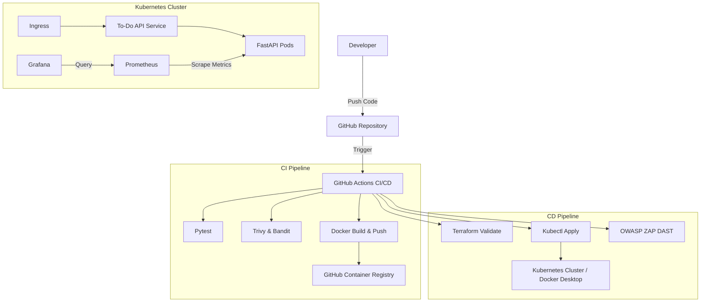
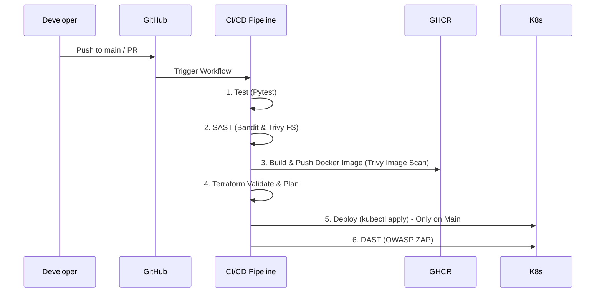

# Trabajo Práctico Final - Curso DevOps

Bienvenido al repositorio del Trabajo Práctico Final del curso de DevOps. En este proyecto se desarrolla, contenedoriza, despliega y monitorea una API de To-Do construida con Python (FastAPI). Todo el ciclo de vida del software es gestionado aplicando las mejores prácticas de DevOps.

## Descripción del Proyecto

Este proyecto consiste en una **To-Do API**RESTful construida con FastAPI, que permite a los usuarios crear, leer, actualizar y eliminar tareas. La infraestructura se provisiona como código (IaC), el empaquetado se realiza con Docker, la orquestación con Kubernetes y cuenta con un pipeline CI/CD completo con escaneos de seguridad.

---

## 🏗 Arquitectura



---

## 🛠 Tecnologías Utilizadas

- **Aplicación:** Python 3.12, FastAPI, Uvicorn, Pytest
- **Contenedores:** Docker, GitHub Container Registry (GHCR)
- **Infraestructura como Código (IaC):** Terraform
- **Orquestación:** Kubernetes (Docker Desktop para desarrollo local)
- **CI/CD:** GitHub Actions
- **Seguridad:** Bandit (SAST), Trivy (Vulnerability Scanner), OWASP ZAP (DAST)
- **Monitoreo y Observabilidad:** Prometheus, Grafana, Helm

---

## 📋 Requisitos Previos

Asegúrate de tener instaladas las siguientes herramientas en tu entorno local:

- [Python 3.12+](https://www.python.org/downloads/)
- [Docker Desktop](https://docs.docker.com/desktop/install/windows-install/) con Kubernetes habilitado (Settings → Kubernetes → Enable Kubernetes)
- [kubectl](https://kubernetes.io/docs/tasks/tools/)
- [Terraform](https://developer.hashicorp.com/terraform/downloads)
- [Helm](https://helm.sh/docs/intro/install/)

---

## 🚀 Guía Paso a Paso

### 1. Clonar el repositorio
```bash
git clone https://github.com/tu-usuario/tu-repo.git
cd tu-repo
```

### 2. Ejecutar localmente (Python)
```bash
cd app
python -m venv venv
source venv/bin/activate  # En Windows: venv\Scripts\activate
pip install -r requirements.txt
uvicorn main:app --reload --host 0.0.0.0 --port 8000
```
La API estará disponible en `http://localhost:8000`.

### 3. Construir la imagen Docker
```bash
docker build -t todo-api:local ./app
docker run -p 8000:8000 todo-api:local
```

### 4. Preparar Kubernetes en Docker Desktop
Docker Desktop ya provee el cluster de Kubernetes. Verificá que esté activo:
```bash
kubectl cluster-info
kubectl get nodes
```

Instalar el Ingress Controller y Metrics Server:
```bash
kubectl apply -f https://raw.githubusercontent.com/kubernetes/ingress-nginx/controller-v1.10.0/deploy/static/provider/cloud/deploy.yaml
kubectl apply -f https://github.com/kubernetes-sigs/metrics-server/releases/latest/download/components.yaml
```

### 5. Desplegar con kubectl
```bash
kubectl apply -f k8s/
kubectl get pods
```

### 6. Desplegar con Terraform
Como alternativa al paso anterior, si deseas provisionar recursos usando Terraform:
```bash
cd terraform
terraform init
terraform plan
terraform apply -auto-approve
```

### 7. Acceder a la API en Kubernetes
Con Docker Desktop, la API es accesible directamente vía `localhost`:
```bash
# Opción 1: Port-forward directo
kubectl port-forward -n todo-app svc/todo-api-service 8000:8000
# Acceder en http://localhost:8000

# Opción 2: Usando Ingress (agregar a C:\Windows\System32\drivers\etc\hosts)
# 127.0.0.1 todo-api.local
# Acceder en http://todo-api.local
```

### 8. Configurar monitoreo (Prometheus + Grafana)
Desplegar los manifiestos de monitoreo incluidos en el proyecto:
```bash
# Aplicar Prometheus (ConfigMap + RBAC + Deployment + Service)
kubectl apply -f monitoring/prometheus-config.yaml

# Aplicar Grafana (Deployment + Service)
kubectl apply -f monitoring/grafana-deployment.yaml

# Verificar que los pods estén corriendo
kubectl get pods -n monitoring
```

Acceder a las interfaces:
```bash
# Prometheus en http://localhost:9090
kubectl port-forward -n monitoring svc/prometheus-service 9090:9090

# Grafana en http://localhost:3000 (usuario: admin / contraseña: admin)
kubectl port-forward -n monitoring svc/grafana-service 3000:3000
```

Para importar el dashboard de Grafana:
1. Abrir Grafana en `http://localhost:3000`
2. Ir a **Connections → Data Sources → Add data source → Prometheus**
3. URL: `http://prometheus-service.monitoring.svc.cluster.local:9090` → Save & Test
4. Ir a **Dashboards → Import** → Subir el archivo `monitoring/grafana-dashboard.json`

### 9. Ejecutar pruebas (Pytest)
```bash
cd app
pytest -v test_main.py
```

### 10. Escaneos de Seguridad (SAST)
```bash
# Instalar Trivy y escanear el sistema de archivos
trivy fs .

# Usar Bandit para código Python
pip install bandit
bandit -r app/
```

---

## 📡 Endpoints de la API

| Método | Endpoint | Descripción |
|--------|----------|-------------|
| GET | `/` | Retorna mensaje de bienvenida y healthcheck. |
| GET | `/todos` | Lista todas las tareas pendientes. |
| POST | `/todos` | Crea una nueva tarea. |
| GET | `/todos/{id}` | Obtiene el detalle de una tarea específica. |
| PUT | `/todos/{id}` | Actualiza una tarea existente. |
| DELETE | `/todos/{id}` | Elimina una tarea. |
| GET | `/metrics` | Endpoint expuesto para ser consumido por Prometheus. |

---

## 💰 FinOps y Estrategia de Recursos

Para garantizar un uso eficiente de los recursos del clúster y evitar sobrecostos (FinOps):
- **Resource Requests & Limits**: Todos los deployments en Kubernetes (`k8s/deployment.yaml`) tienen configurados `requests` y `limits` de CPU y Memoria. Esto asegura que la aplicación solo consuma lo que necesita y protege a los nodos de OOM (Out Of Memory).
- **Horizontal Pod Autoscaler (HPA)**: Se ha implementado un HPA configurado para escalar a partir del 70% de utilización de CPU. Esto permite responder a picos de tráfico de forma automática, sin necesidad de mantener instancias sobre-provisionadas y ociosas durante periodos de bajo tráfico.

---

## 📊 Monitoreo (Prometheus + Grafana)

La API instrumentada exporta métricas en el formato de Prometheus a través del endpoint `/metrics`.
- **Prometheus**: Realiza el "scraping" de nuestras réplicas. Nos permite crear alertas y analizar la latencia y tasa de errores.
- **Grafana**: Utilizado para visualizar las métricas. Se construyen dashboards donde se observa:
  - Tasa de requests por segundo (RPS).
  - Tiempo de respuesta (Latencia P95/P99).
  - Tasa de errores HTTP (4xx, 5xx).
  - Uso de recursos de los Pods (CPU/RAM).

---

## 🔄 CI/CD Pipeline

Nuestro flujo de integración y despliegue continuo consta de las siguientes etapas automatizadas mediante GitHub Actions:



1. **Test**: Ejecuta `pytest` para garantizar el correcto funcionamiento.
2. **SAST**: Ejecuta análisis de código estático con Bandit y de vulnerabilidades de paquetes y configuraciones con Trivy.
3. **Build & Push**: Empaqueta la aplicación en Docker, la sube a GHCR y analiza la imagen.
4. **Terraform Validate**: Comprueba la sintaxis de IaC.
5. **Deploy**: Aplica los manifiestos en el clúster.
6. **DAST**: Una vez desplegada la aplicación, lanza un análisis dinámico contra la URL expuesta mediante OWASP ZAP.

---

## 📁 Estructura del Proyecto

```text
.
├── .github/
│   └── workflows/
│       └── ci-cd.yml      # Definición de GitHub Actions
├── app/
│   ├── main.py            # Código fuente de FastAPI
│   ├── test_main.py       # Pruebas automatizadas (Pytest)
│   ├── requirements.txt   # Dependencias de Python
│   └── Dockerfile         # Receta para construir la imagen de la API
├── k8s/
│   ├── deployment.yaml    # Definición de Deployments y HPA
│   ├── service.yaml       # Definición de Service (ClusterIP/NodePort)
│   └── ingress.yaml       # Definición de Ingress (Opcional)
├── terraform/
│   ├── main.tf            # Definición principal de infraestructura
│   ├── variables.tf       # Variables de entrada
│   └── outputs.tf         # Variables de salida
└── README.md              # Este archivo
```

---

## 📷 Evidencias

*(Espacio para incluir capturas de pantalla)*

- Captura del pipeline CI/CD en GitHub Actions exitoso.
- Captura de pantalla de la UI de Swagger (`/docs`).
- Captura del dashboard de Grafana con métricas.
- Captura de `kubectl get pods -n todo-app` mostrando los Pods ejecutándose.

---

## 👤 Autor

**Joaquín**  
- Curso de DevOps
- GitHub: [tu-usuario](https://github.com/tu-usuario)

*¡Gracias por revisar este proyecto!*
